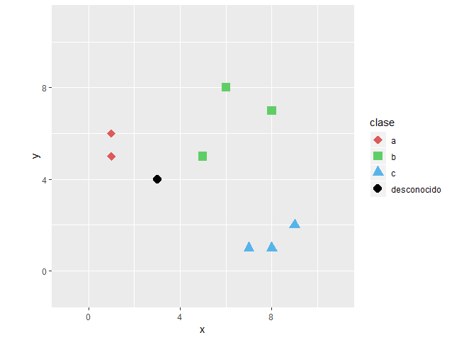
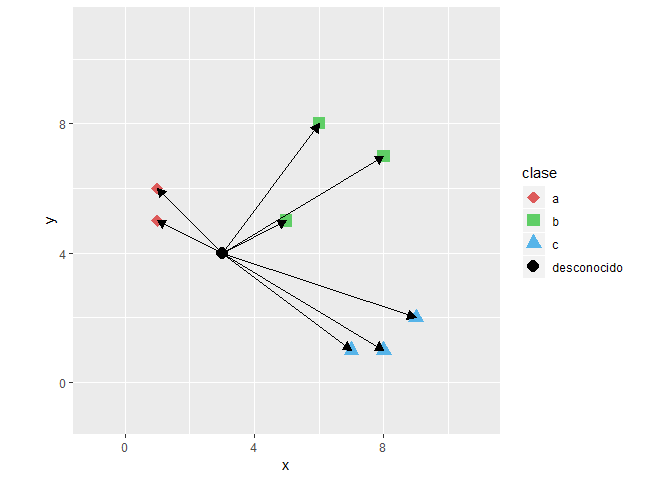
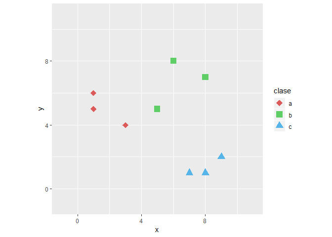
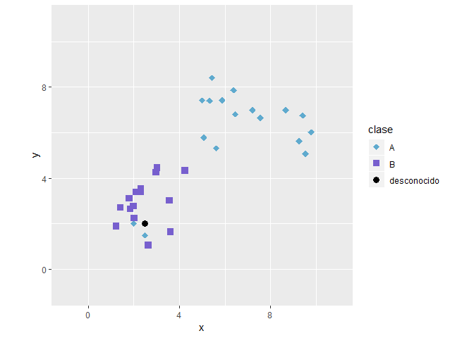
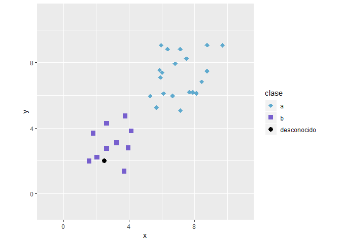
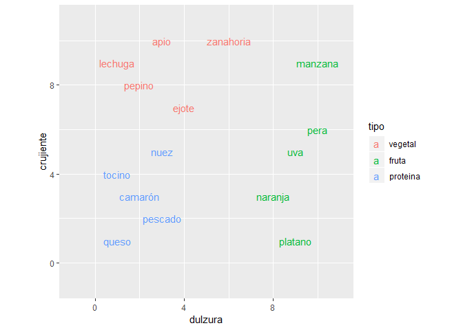
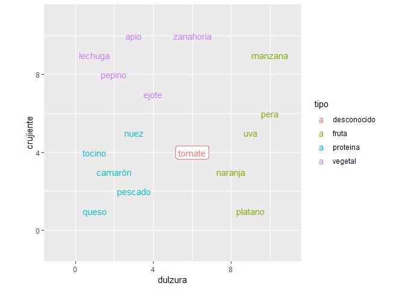

``` r
library(tidyverse)
library(ggplot2)
```

En este tutorial explicare los conceptos básicos acerca del algoritmo K vecinos cercanos (k-Nearest Neighbor) o simplemente KNN.

Quizás este sea uno de los algoritmos mas sencillos en machine learning, de hecho muchos autores hacen llamar a este algoritmos como un algoritmo de **aprendizaje flojo**(lazy learning), ya que en un sentido estricto el algoritmo no esta aprendiendo, y tampoco ocurre una abstracción como tal, lo que sucede es que en la fase de entrenamiento simplemente almacena datos, por lo que no surge una abstracción del modelo, simplemente **memoriza** de tal manera que el aprendizaje sucede por memorización, haciendo muy lenta la fase de predicción.

Sin embargo es un algoritmo muy utilizado para la clasificación ya que tiene muy buenas características que ayudan a dar un primer vistazo a los datos e inclusive ser el algoritmo final.

Veamos algunas de sus fortalezas y debilidades

<table style="width:8%;">
<colgroup>
<col width="4%" />
<col width="4%" />
</colgroup>
<thead>
<tr class="header">
<th>Fortalezas</th>
<th>Debilidades</th>
</tr>
</thead>
<tbody>
<tr class="odd">
<td>Simple y efectivo</td>
<td>Al no producir un modelo es difícil seguir como las variables se relacionan con las clases</td>
</tr>
<tr class="even">
<td>No es muy necesario hacer suposiciones de los datos</td>
<td>Requiere una selección apropiada del valor K</td>
</tr>
<tr class="odd">
<td>Fase de entrenamiento rápida</td>
<td>Fase de clasificación lenta</td>
</tr>
<tr class="even">
<td></td>
<td>Variables nominales y datos faltantes requieren de un trato especial</td>
</tr>
</tbody>
</table>

Definiendo el modelo
--------------------

Muy bien ya explicamos las debilidades y bondades del algoritmo ahora toca explicar como funciona.

Imaginemos que deseamos clasificar una nueva observación (punto negro) y existen tres posibles clases



### Paso uno

Debemos calcular la distancia de este nuevo punto (observación) hacía todos los otros puntos que ya se encuentran etiquetados con su clase correspondiente para después ordenar de menor a mayor.



|      dist| clase |
|---------:|:------|
|  2.236068| a     |
|  2.236068| b     |
|  2.828427| a     |
|  5.000000| b     |
|  5.000000| c     |
|  5.830952| b     |
|  5.830952| c     |
|  6.324555| c     |

### Paso dos

Ya que tenemos las distancias ordenadas de menor a mayor basta con tomar los mas cercanos al punto a clasificar, lo cual esta determinado con el valor K seleccionado, digamos que para este ejemplo el valor de K es 3

|      dist| clase |
|---------:|:------|
|  2.236068| a     |
|  2.236068| b     |
|  2.828427| a     |

### Paso tres

Ahora solo basta con observar la clase que mas se repite en los K vecinos seleccionados y !Felicidades! hemos clasificado la nueva observación.

| clase |    n|
|------:|:----|
| a     |    2|
| b     |    1|

En este ejemplo vemos que el que mas se repite es la clase ***a*** por lo tanto nuestra figura pertenece a esta clase.



### Distancias

Es importante mencionar que para el ejemplo anterior la forma en la que medimos las distancias fue mediante la distancia Euclidiana

$$\sqrt{\sum_{i=1}^{m}(x_{i}-y_{i})^{2}}$$

la cual es la mas utilizada sin embargo también se puede calcular mediante distancia Manhattan

$$\sum_{i=1}^{m}\left | x_{i}-y_{i} \right |$$

o mediante la distancia Hamming usualmente para identificar si un valor a cambiado o se mantiene igual

si *x* = *y* entonces la distancia es igual a 0

si *x* ≠ *y* entonces la distancia es igual a 1

| x     | y     | distancia |
|-------|-------|-----------|
| perro | perro | 0         |
| perro | gato  | 1         |

### Valor de k

Optimizar el valor de K es de suma importancia, ya que al elegir un k-valor muy pequeño es posible que el ruido de los datos tome importancia, por otro lado si el valor de k es alto la clase que sea mayoría tendrá un peso importante.

A continuación explicare gráficamente lo anterior.

#### k-valor pequeño (overfitting)

Imaginemos el siguiente caso:



De elegir un k-valor de 3 la nueva observación será colocado en la clase ***A*** aunque visualmente es evidente que pertenece a la clase ***B***, sin embargo aquí es donde el **ruido toma importancia**, y se dice que el modelo esta sobre ajustado.

#### k-valor alto (underfitting)



Por otra parte si tomamos el otro extremo donde k es igual al total de los datos, pasara el subajuste del algoritmo, ya que visualmente el punto desconocido pertenece a la clase ***B*** sin embargo al ser la clase ***A*** mayoría, es aquí donde será clasificado.

Al analizar los extremos (k muy pequeño y k muy alto) es clara la importancia de un k-valor adecuado, normalmente se escoge como un buen valor de inicio la raíz cuadrada del numero de datos para el entrenamiento, sim embargo es buena practica tomar varios valores de k, y observar cual de estos es el que nos da una mejor clasificación de los datos de entrenamiento.

Clasificación de frutas
=======================

Ahora toca hacer un clasificar de alimentos usando el algoritmo KNN.

Crearemos los datos

``` r
vegetales <- data.frame(nombre = c("zanahoria","apio","ejote","pepino","lechuga"),
                        dulzura = c(6,3,4,2,1),
                        crujiente = c(10,10,7,8,9),
                        tipo = "vegetal"
                        )

frutas <- data.frame(nombre = c("manzana","platano","uva","naranja","pera"),
                        dulzura = c(10,9,9,8,10),
                        crujiente = c(9,1,5,3,6),
                        tipo = "fruta"
                        )

proteina <- data.frame(nombre = c("tocino","queso","nuez","camarón","pescado"),
                        dulzura = c(1,1,3,2,3),
                        crujiente = c(4,1,5,3,2),
                        tipo = "proteina"
                        )

alimentos <- rbind(vegetales,frutas,proteina)
```

Como vemos tenemos tres clases(*tipo*) **vegetales, frutas y proteínas**, cada uno de los alimentos tiene una calificación que se encuentra entre 1 y 10, califican que tan crujientes y dulces son.

Gráficamente estarían representados de la siguiente manera 

Pero ¿Y un tomate? ¿A que clase pertenece? Veámoslo

``` r
tomate <- data.frame(nombre = "tomate",
                        dulzura = 6,
                        crujiente = 4,
                        tipo = "desconocido"
                        )
```

``` r
plot + geom_label(data=tomate, aes(dulzura,crujiente,label="tomate"))
```



Crearemos una función que nos ayudara a calcular la distancia que existe de un punto a todos los demás

``` r
dist <- function(point,data){

  sqrt((point[1]-data[,1])^2+
       (point[2]-data[,2])^2)
}
```

Ahora calculemos todas las distancias a nuestro tomate y ordenémoslo

``` r
distancias <- data.frame(nombre = alimentos$nombre,
                          tipo = alimentos$tipo,
                          dist=dist(point = c(6,4),data = alimentos[,2:3]))%>%
   arrange(dist)   

knitr::kable(distancias)
```

| nombre    | tipo     |      dist|
|:----------|:---------|---------:|
| naranja   | fruta    |  2.236068|
| uva       | fruta    |  3.162278|
| nuez      | proteina |  3.162278|
| ejote     | vegetal  |  3.605551|
| pescado   | proteina |  3.605551|
| camarón   | proteina |  4.123106|
| platano   | fruta    |  4.242641|
| pera      | fruta    |  4.472136|
| tocino    | proteina |  5.000000|
| pepino    | vegetal  |  5.656854|
| queso     | proteina |  5.830952|
| zanahoria | vegetal  |  6.000000|
| manzana   | fruta    |  6.403124|
| apio      | vegetal  |  6.708204|
| lechuga   | vegetal  |  7.071068|

la siguiente función nos regresara la clase correspondiente al K valor seleccionado

``` r
resultado <- function(distancias,k) {
  result <- head(distancias,k) %>%
    group_by(tipo) %>%
    summarise(n = n()) %>%
    arrange(desc(n))

  cat("Pertenece a" ,as.character(result$tipo[1]) )

}
```

``` r
resultado(distancias,4)
```

    ## Pertenece a fruta

Genial nuestro tomate es una fruta! :D

Ahora metamos todo en la función ***clasificador*** y veamos que sucede al clasificar un Piña.

``` r
clasificador <- function(point,dataframe,k) {
  #Calculando distancias y ordenándolo
  distancias <- data.frame(nombre = alimentos$nombre,
                          tipo = alimentos$tipo,
                          dist=dist(point=point,alimentos[,2:3])) %>%
    arrange(dist)

  #Calsificando de acuerdo al k-valor
  resultado(distancias,k)
}
```

``` r
clasificador(c(8,4),alimentos,4)
```

    ## Pertenece a fruta

Conclusiones
------------

Como vimos quizás no es un algoritmo super elaborado, sin embargo es un algoritmo que es muy intuitivo y excelente para comenzar este lindo camino de la ciencia de datos y machine learning. Aquí se mostro como funciona si te gustaría profundizar más te invito a que investigues por que es importante tener variables estandarizadas.
